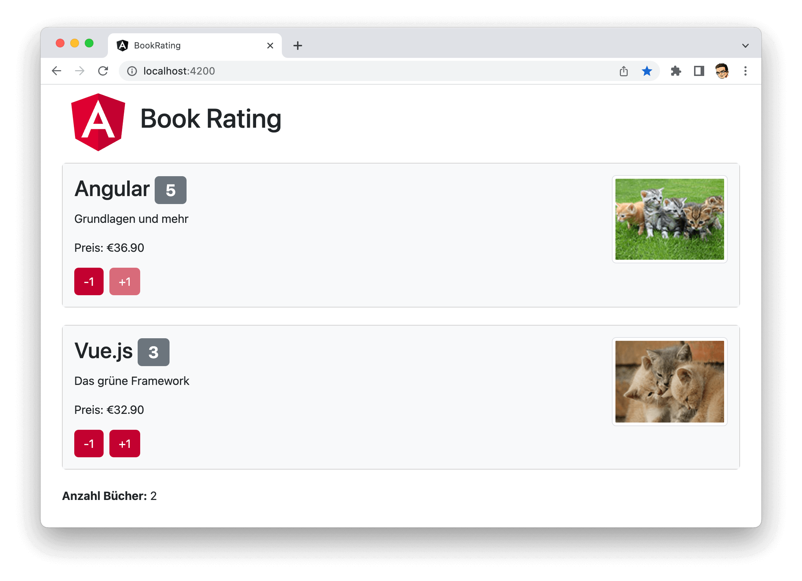

#### **mit Johannes Hoppe**

<hr>

**Herzlich Willkommen – und schön, dass du dabei bist!**  
In diesem Repository findest du alle Infos zur Vorbereitung und während des Workshops den Quelltext unserer Beispielanwendung.

<!--
# 🎮 RxJS Playground

Du kannst dir entweder  
* dieses Repository per Git herunterladen und in den Ordner `rxjs-playground` wechseln<br>**oder**<br>  
* den Code als ZIP-Datei herunterladen: [rxjs-playground.zip](XXX)

```bash
cd rxjs-playground
npm install
npm start
```

Öffne den Browser unter der URL [http://localhost:**4300**](http://localhost:4300), um die Anwendung zu sehen.
Die Übungen befinden sich im Ordner `rxjs-playground/src/app/exercises/`.
-->

# ✅ Vorbereitung

Damit wir gleich durchstarten können, solltest Du ein paar Vorbereitungen treffen.  
Die gesamte Installation wird rund 30 Minuten dauern. 

## 1.) Benötigte Software

1. **Node.js 14 oder 16**: [https://nodejs.org](https://nodejs.org)
   + Mac-Nutzer:innen bitte Homebrew verwenden! ([siehe Anleitung](https://presentations.angular.schule/HOMEBREW_NODE))
2. **Google Chrome:** [https://www.google.com/chrome/](https://www.google.com/chrome/)
   + [Angular DevTools](https://chrome.google.com/webstore/detail/angular-devtools/ienfalfjdbdpebioblfackkekamfmbnh)
   + [Redux DevTools](https://chrome.google.com/webstore/detail/redux-devtools/lmhkpmbekcpmknklioeibfkpmmfibljd)
3. **Visual Studio Code:** [https://code.visualstudio.com](https://code.visualstudio.com)
   + Wir empfehlen dir eine Auswahl an Extensions für Visual Studio Code.  
     Dazu haben wir ein Extension Pack vorbereitet, das alles Nötige einrichtet:  
     [Angular-Schule: Extension Pack](https://marketplace.visualstudio.com/items?itemName=angular-schule.angular-schule-extension-pack)


## 2.) Proxy?

Für die Proxykonfiguration im Unternehmensnetz sind gesonderte Einstellungen nötig.
Wir haben dir hierfür folgende Anleitung erstellt:
https://workshop.angular.schule/proxy  
Sollte es Probleme mit dem Proxy geben, melde Dich bitte bei uns, dann finden wir eine Lösung.


## 3.) Pakete installieren

Die Angular CLI ist das offizielle Build-Tool für Angular. Mit folgendem Befehl kannst Du die CLI auf dem System installieren:

```bash
npm install -g @angular/cli
```

⚠️ Überprüfe bitte anschließend die Versionen, damit wir beim Workshop alle auf dem gleichen Stand sind:

```
node -v
> Erwartet: v14.x oder v16.x

npm -v
> Erwartet: 6.x oder höher

ng version
> Erwartet: 14.x.x (!)
```


## 4.) Demo Anwendung herunterladen

Bitte installiere das Übungsprojekt schon vor Beginn des Workshops.

Du kannst dir entweder  
* dieses Repository per Git herunterladen und in den Ordner `book-rating` wechseln<br>**oder**<br>  
* den Code als ZIP-Datei herunterladen: [book-rating.zip](https://github.com/angular-schule/2022-11-angular-workshop-regensburg/files/9942494/book-rating.zip)

> ⚠️ Bitte installiere das Projekt nicht auf einem Netzlaufwerk, sondern direkt auf der lokalen Festplatte!

```bash
cd book-rating
npm install
npm start
```

Die Installation kann bei langsamer Internetverbindung sehr lange dauern.
Warte beim Schritt `Installing packages (npm)` mit Geduld ab!


> Auf http://localhost:4200 sollte nun eine Website mit der Überschrift *"Book Rating"* erscheinen!

<br>



Beende danach den laufenden Webserver mit Strg + C.


## 5.) Test-Umgebung prüfen

Prüfe bitte, ob der folgende Befehl ohne Fehlermeldungen ausführt:

```bash
npm test
```

Anschließend kannst du den Prozess wieder mit Strg + C beenden.


### Wir freuen uns schon! 🙂

Wenn bei allen Teilnehmenden das Grundgerüst steht, können wir ohne Zeitverlust loslegen.
Sollte es zu einer Fehlermeldung kommen, dann sende uns den Fehlertext einfach per Mail an [team@angular.schule](mailto:team@angular.schule).

<hr>


### &copy; https://angular.schule | Stand: 05.11.2022

